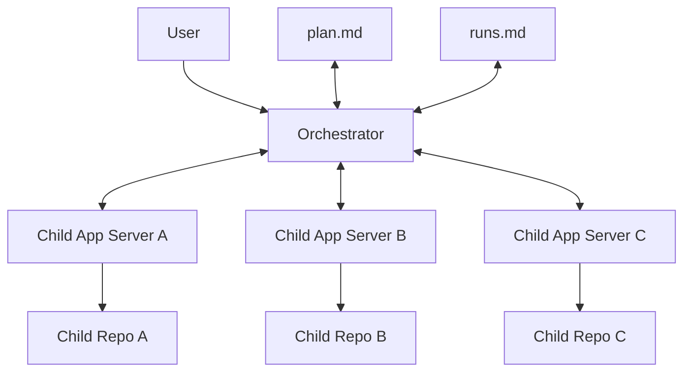

# Codex Orchestrator

Coordinate work across multiple repos from one OpenAI Codex session.

A common example is coordinating work or debugging issues that span `frontend`, `backend`, `edge`, or `microcontroller firmware`, but this works for any set of repos that need to move together.

The workflow is:
- each child repo runs its own `codex app-server`
- the parent orchestrator connects to those child App Servers
- the orchestrator deeply understands each repo and how the repos work together
- the orchestrator writes `plan.md`
- only then does the orchestrator delegate and track execution in `runs.md`

This repo is designed to work with the App Server functionality in Codex.

## Model



The user talks only to the orchestrator.

## Limitations

- This pattern is designed around App Server. Sharing a Codex session as an MCP server does not expose enough useful information to the orchestrator for this workflow.
- After you run `codex app-server` in each child repo, that terminal mostly just hosts the server process. It does not give you a useful live view of the child run.
- In practice, execution visibility lives in the orchestrator session and in `runs.md`, not in the child App Server terminals.

## Install

Install the skill:

```bash
mkdir -p "$HOME/.codex/skills"
cp -R /absolute/path/to/codex-orchestrator/skills/codex-orchestrator "$HOME/.codex/skills/"
```

Then invoke:

```text
$codex-orchestrator
```

## Workflow

### 1. Start Each Child App Server

In a separate terminal for each child repo:

```bash
cd /absolute/path/to/child-1
pwd
codex app-server
```

```bash
cd /absolute/path/to/child-2
pwd
codex app-server
```

```bash
cd /absolute/path/to/child-3
pwd
codex app-server
```

Copy the `pwd` output for each repo. You will paste those paths into the orchestrator. Use plain `codex app-server` by default.

### 2. Start The Orchestrator

In the orchestrator repo:

```bash
cd /absolute/path/to/codex-orchestrator
pwd
codex
```

If you want to run the orchestrator in YOLO mode, this is the place to do it:

```bash
cd /absolute/path/to/codex-orchestrator
pwd
codex --dangerously-bypass-approvals-and-sandbox
```

Use that only if you intentionally want the orchestrator to run with maximum autonomy. In most cases, child App Servers should still stay on plain `codex app-server`.

Then invoke:

```text
$codex-orchestrator
```

Best case, you give the orchestrator everything it needs in one kickoff prompt:
- the problem to solve
- the pasted absolute working directory for each child repo
- any optional logging, instrumentation, or pre-execution test requests

From there, it should proceed mostly autonomously. It should only ask you for more input when a step genuinely requires human action or human judgment.

### 3. What Happens Next

The orchestrator will:
- understand code, git state, commit history, and docs in each repo
- understand how the repos work together
- write `plan.md`
- execute only after the plan exists
- keep `runs.md` updated as it learns more

If the user asked for extra logging, instrumentation, or test runs, the orchestrator should include that in `plan.md`.

If a child needs testing, approval, credentials, or clarification, the orchestrator should stop there and ask the user with exact steps and the exact result it needs back.

Example kickoff prompt:

```text
Use $codex-orchestrator.
The problem is: <describe the problem>.
The child repo directories are:
- child-1=<paste pwd>
- child-2=<paste pwd>
- child-3=<paste pwd>
```

## End-To-End Example

Example: `frontend`, `backend`, and microcontroller firmware all need coordinated work for a new device onboarding flow.

1. Start each child repo like this and copy each repo path with `pwd`:

```bash
cd /absolute/path/to/child-repo-0
pwd
codex app-server
```

```bash
cd /absolute/path/to/child-repo-1
pwd
codex app-server
```

```bash
cd /absolute/path/to/child-repo-2
pwd
codex app-server
```

2. Start Codex in the orchestrator repo and invoke `$codex-orchestrator`.
3. Give the orchestrator one kickoff prompt with the problem statement and the pasted repo paths.
4. The orchestrator will understand each child repo, identify the cross-repo contracts, and write `plan.md`.
5. Only then will it delegate execution to the child repos and keep `runs.md` updated. It should only come back to you when it actually needs input.

Example prompt:

```text
Use $codex-orchestrator.
The problem is: when the app tries to connect a new device, the frontend
shows "Connecting..." for about 30 seconds and then fails with
"device registration timed out", even though the backend eventually creates
the device record and the microcontroller firmware appears online a few
seconds later.
The child repo directories are:
- frontend=<paste pwd from child-repo-0>
- backend=<paste pwd from child-repo-1>
- firmware=<paste pwd from child-repo-2>
```

## Files

- `plan.template.md`: template for the live `plan.md`
- `runs.template.md`: template for the live `runs.md`
- `skills/codex-orchestrator/`: the skill

Generated working files such as `plan.md`, `runs.md`, and `orchestrator.config.yaml` are intentionally gitignored.

## Contributing

Contribute reusable improvements to the skill, templates, and docs. Do not commit generated local state such as `plan.md`, `runs.md`, `orchestrator.config.yaml`, or `.orchestrator/`.
